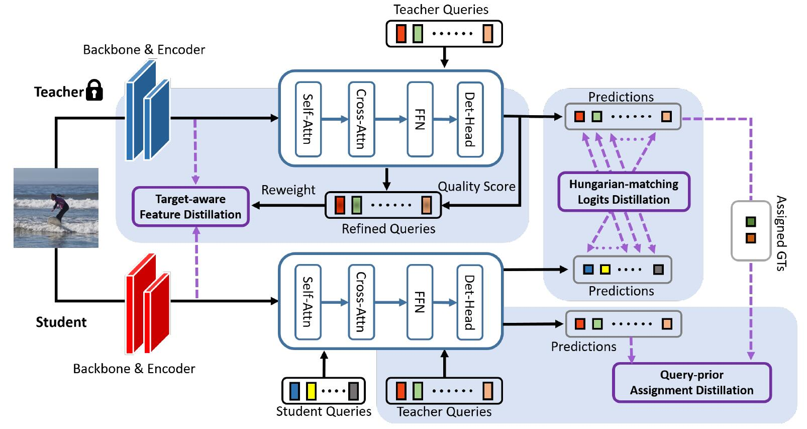

<div align="center">
<h1> DETRDistill </h1>
<h3>A Universal Knowledge Distillation Framework for DETR-families</h3>
<br>Jiahao Chang, Shuo Wang, Hai-Ming Xu, Zehui Chen, Chenhongyi Yang, Feng Zhao. 
<br>

<div><a href="https://arxiv.org/pdf/2211.10156.pdf">[Paper] </a></div> 

<center>

</center>

</div>

## Install MMDetection and MS COCO2017
  - Our codes are based on [MMDetection](https://github.com/open-mmlab/mmdetection). Please follow the installation of MMDetection and make sure you can run it successfully.
```bash
pip install torch==1.9.0+cu111 torchvision==0.10.0+cu111 torchaudio==0.9.0 -f https://download.pytorch.org/whl/torch_stable.html
pip install mmcv-full==1.4.0
cd our project
pip install -r requirements/build.txt
pip install -v -e .
```
- Unzip COCO dataset into data/coco/
- Modify pretraining R-101/R-50 and our teacher model weight path

## Train

```
#multi GPU
bash tools/dist_train.sh  cfg_distill/deformdetr_r101_2x_distill_r50_LayerbyLayer_CL_teachergroup.py  8
```


## Transfer
```
# Tansfer the saved model into mmdet model
python pth_transfer.py --ckpt_path $ckpt --output_path $new_mmdet_ckpt
```
## Performance

### MS COCO Val set
|    Model    |  Backbone  | mAP |                            config                            |                          weight                          | log |
| :---------: | :--------: | :-----------: | :----------------------------------------------------------: | :------------------------------------------------------: | :--: |
|  Deformable DETR  | ResNet-101  |     44.8     | [config](https://github.com/BIVLab-USTC/DETRDistill/blob/main/project/cfg_distill/deformable_detr/deformable_detr_r101_16x2_50e_coco_teacher.py) | [baidu](https://pan.baidu.com/s/16FHMFteZGoX4ui6hoB44Tg?pwd=xi35) | [baidu](https://pan.baidu.com/s/1e1OwOeBTKsPhDFBR2oqXzQ?pwd=5xqi) |
|  Deformable DETR  | ResNet-50  |     44.1     | [config](https://github.com/BIVLab-USTC/DETRDistill/blob/main/project/cfg_distill/deformable_detr/deformable_detr_r50_16x2_50e_coco_student.py) | [baidu](https://pan.baidu.com/s/1UnfulC64iuCg6ZGREyhVxg?pwd=w2xv) | [baidu](https://pan.baidu.com/s/10BVPV9OUK6xtsA62vem02Q?pwd=j87v) |
|  Deformable DETR-Distill  | ResNet-50  |     46.6(+2.5)    | [config](https://github.com/BIVLab-USTC/DETRDistill/blob/main/project/cfg_distill/deformdetr_r101_2x_distill_r50_LayerbyLayer_CL_teachergroup.py) |  | [baidu](https://pan.baidu.com/s/1Q1dcjc74Uk9O9KVrt6hfOg?pwd=n9hu) |
|  Deformable DETR  | ResNet-18  |     40.0     | [config](https://github.com/BIVLab-USTC/DETRDistill/blob/main/project/cfg_distill/deformable_detr/deformable_detr_r18_16x2_25e_coco_student.py) | |  |
|  Deformable DETR-Distill  | ResNet-18  |     43.3(+3.3)    | [config]() |  |  |


## NOTE

This repository is an initial draft, we will release more code in the future.

## Acknowledgement

Our code is based on the project [MMDetection](https://github.com/open-mmlab/mmdetection).
Thanks to the work [FGD](https://github.com/yzd-v/FGD).
